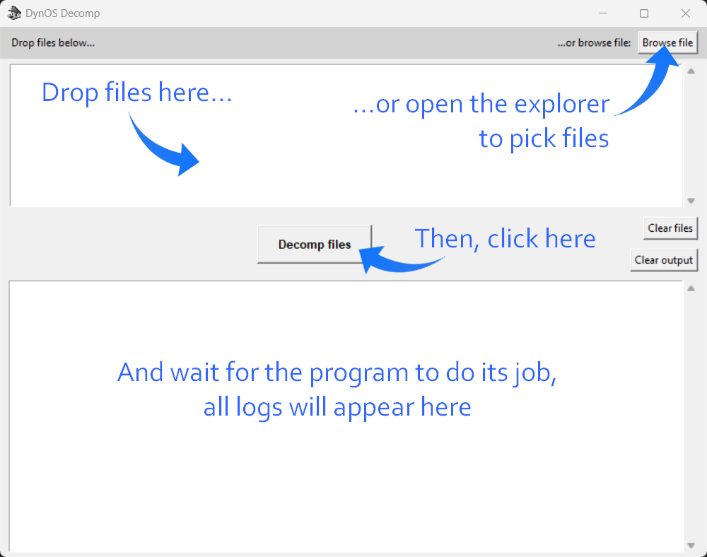

```
  ______  ___  _  __  ____
  \   \ \/ / \| |/  \/ __/
   | D \  /| \\ | () \__ \
  /___//_/ |_|\_|\__/____/
        D E C O M P
```

A GUI made in Python to decompile DynOS binary files.

## Installation

- Make sure Python is installed in your system (if not, go to https://www.python.org/downloads/)
- Clone or download this repository
- Launch `dynos-decomp-gui.pyw`

## How to use



## Supported file formats

- Actor files (`.bin`, `.bin.raw`)

## Troubleshooting

If the program doesn't start, you might need to install `tkinterdnd2`:
- Open a terminal (on Windows: press `[Ctrl] + [R]`, input `cmd` then hit `[Enter]`)
- Run this command: `pip install tkinterdnd2`
- Close the terminal and launch the program again
